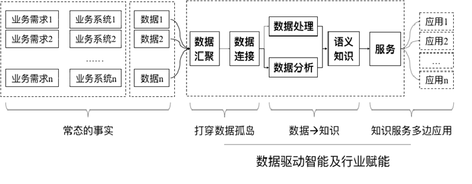
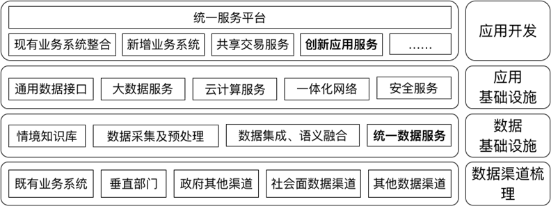

# 大数据学习笔记
## 引导
---
### 我国大数据的现状
★ 基础理论核心技术落后  
★ 大数据框架建没仍匮乏  
★ 数据治理体系远未形成  
★ 应用发展不均衡待推进 
---
### 数据与大数据
大数据泛指无法在可容忍时间内用传统信息技术手段和硬件工具对其进行获取、管理和处理的巨量数据集合，具有海量性、多样性、时效性以及可变性等特征，需要可伸缩的计算体系结构以支持其存储、粗合理和分析。
**大数据现象将长期存在**
### 大数据应用现状
+ 应用环境特点
    + 应用需求迫切
    + 应用场景丰富
    + 有IT基础设施支撑
    + 多边普遍认同
+ 技术环境特点
    + 技术预研及人才储备持续进行中
    + 基础设施建设逐渐完善
    + 产业化分工逐渐明晰
    有可借鉴的示范应用

大数据的数据来源：数据市场、数据搜集、个人数据    
---
## 大数据的多边定义
* 大数据的产生方式：
业务系统-->UGC-->物联网
### 研究视角（技术层面）
+ 数据汇聚：数据抽取、多数据源融合、数据关联、数据清洗、数据更新策略...
+ 数据处理：数据存储、数据管理、并行处理、容错机制、工作流量管理...
+ 数据分析：基础特征、特征工程、模拟训练、结果评估...
+ 计算环境：单点计算、GPU技术、分而治之...
---
## 大数据的价值实现
### 大数据的应用逻辑

### 大数据工程管理
| 重要环节|软件工程|大数据工程|
|-|-|-|
|问题定义|明确定义用户（甲方）是谁？目标是什么？等等|明确定义用户（甲方）是谁？应用场景是什么？等等|
|可行性分析|从技术、人力、法律等方面论证是否可以以及是否值得做？|除了与软件工程雷同的评估指标外，还需理性评估目标场景是否合适大数据思维加以响应？|
|项目计划|按照既定的目标进行项目的分期部署，往往有明确的理论或者方法精准预估工作量、工作进度、投资回收期、产品推广方式；|往往是分期部署，每期的部署都应该具备“造血”能力，项目的收益来源于系统的运维，研发的中间产品往往也可以获益；
|需求分析|甲乙双方在沟通、协同的前提下完成对显式、隐式需求的无歧义表示，需求来源于用户；|往往只有模糊的需求，甚至只有应用场景的描述而没有明确的需求表示？更多的情况下，需求是在开发的过程中新增和引导出的；需求来源于数据；
|概要设计|在需求明确的情况下，设计系统的总体结构，一般是以模块结构图设计作为标志，根据不同需求，系统模块结构不一样；|总体结构化一定是按照“采集存取建模系统”进行，技术路线清晰。重点需要考虑数据的来源和存储的选型；
|详细设计|按照概要设计的约定对每一个模块、每一个类的算法选型、输入输出格式等进行详细的设计|根据需求的理解和延展的基础上，从数据服务、计算服务、应用服务、系统平台四个角度对各个环节的技术选型进行论证，往往需要进行测试评估以确定技术选型的合理性|
|代码编写|按照设计的要求进行代码的编写|根据技术选型的约定进行算法的选取及编写，有大量的开源代码，往往需要改进和预研；|
|测试|用白盒或者黑盒等策略进行功能测试或者性能测试等，早期的需求分析和设计手册是评估基础；|除了进行类似软件工程的测试而外，还需要对数据建模性能进行测试和评估，以引发新一轮的技术迭代，实际应用效果是评估基础|
|维护|纠错性维护、完善性维护、预测性维护等等|除了软件工程意义上的（软件）运维而外，还包括技术运维和价值运维；|

### 大数据的关键技术
- 分布式大数据平台
- 流数据与实时决策
- 数据仓库平台优化
- 数据分析与可视化
- 数据与应用集成
- 数据质量与生命周期管理

 
